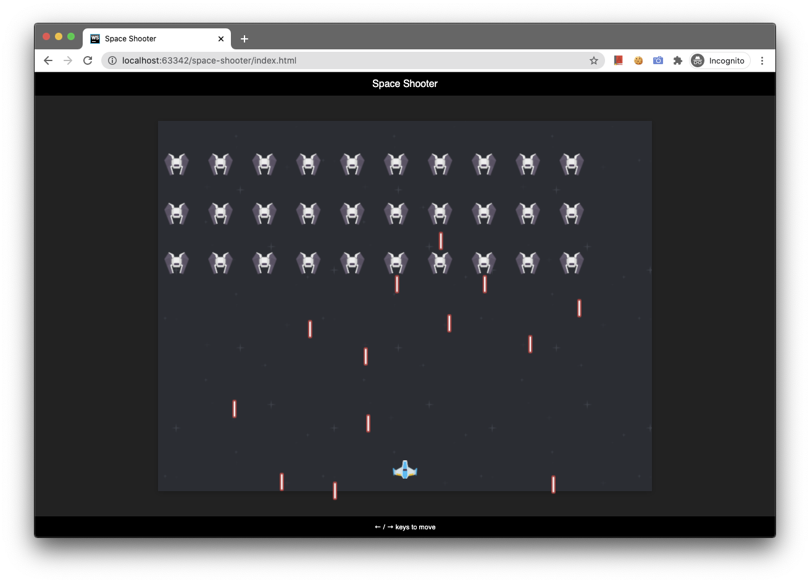

# 🚀 Space Shooter

## Description
Fight the enemy ships before they destroy you, use the arrow keys to move, and the space bar to shoot.

This is a **Space Shooter** game done to showcase vanilla JavaScript.

[Play the Game!](http://gerardocortes.com/space-shooter/index.html)

_Original project by [Frederik De Bleser](https://github.com/fdb)._

---

# Local Development

## Technology Stack
- JavaScript
- HTML
- CSS

## Set Up
Open the `index.html` file in your preferred browser.

---

# Deployment
You can embed the game by copying the _wrap_ `div` from the index.html and importing the assets.

---

# User Guide
## Documentation
You can change the "sprites" by choosing other images from the `img` folder and replacing them in the `js/game.js` file.

The actual sprites used are:
- `img/player-blue-1.png`
- `img/laser-blue-1.png`
- `img/enemy-black-1.png`
- `img/laser-red-5.png`

---

# Credits
- [Gerardo Cortes](mailto:mail@gerardocortes.com)
- Original project by [Frederik De Bleser](https://github.com/fdb/space-game)
